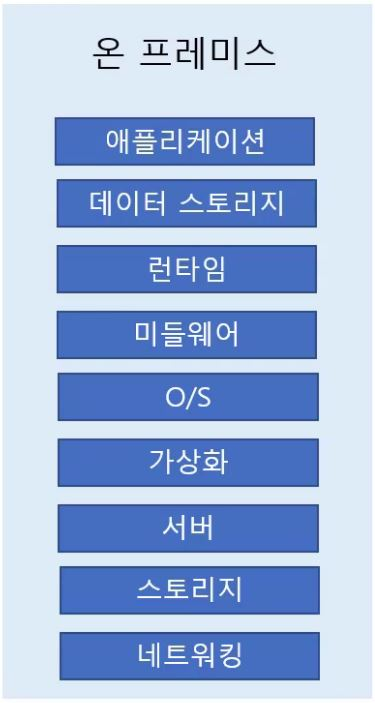
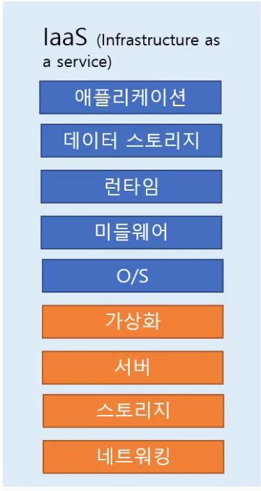
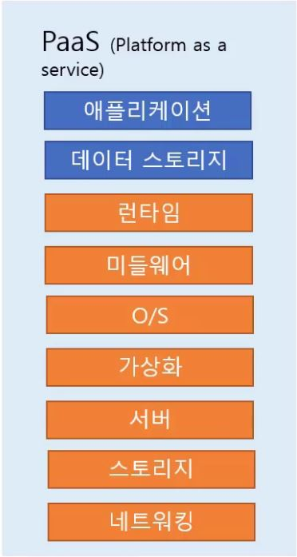
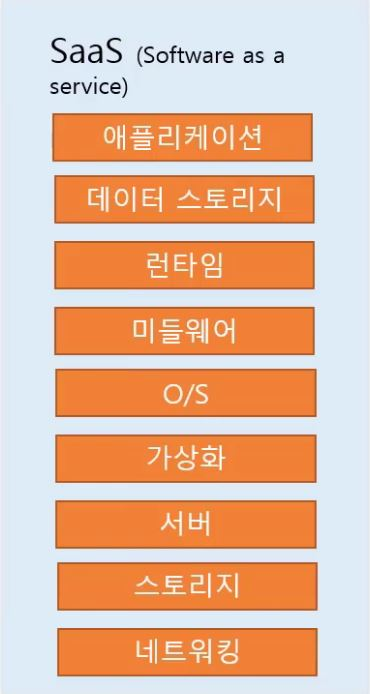

# 클라우드 컴퓨팅 모델

- 공급자(클라우드 서비스 제공자)와 사용자(고객)이 관리하는 영역에 따라 모델이 나누어집니다.

## 온 프레미스

- 

- 사용자가 인프라부터 모든 것을 다 관리하는 것을 말합니다.

## IaaS(Infrastructure as a Service)

- 

- 물리적인 부분은 공급자가 관리합니다.

- OS부터 스토리지, 애플리케이션은 사용자가 관리합니다.

- Amazon EC2가 대표적인 예입니다.

## PaaS(Platform as a Service)

- 

- 물리적인 부분, OS 부분 등은 공급자가 모두 관리합니다.

- 사용자는 데이터와 애플리케이션만 관리합니다.

- 사용자는 애플리케이션 개발에만 집중할 수 있습니다.

- AWS Elastic Beanstalk이 대표적인 예입니다.

## SaaS(Software as a Service)

- 

- 모든 부분을 공급자가 관리하고 사용자는 서비스를 사용만 하면 됩니다.

- Goolge Gmail이 대표적인 예입니다.
